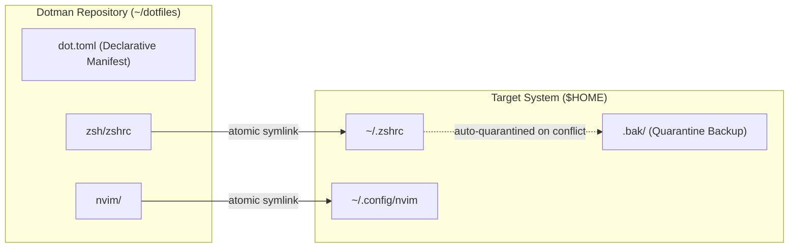

<p align="center">
  
</p>

<h1 align="center">dotman</h1>

<p align="center">
  <strong>Fast, safe, and transparent dotfile manager in Rust.</strong>
</p>

<p align="center">
  <a href="https://github.com/brilyyy/dotman/releases"></a>
  <a href="https://www.rust-lang.org"></a>
  <a href="https://github.com/brilyyy/dotman/blob/main/LICENSE"></a>
  
  
  
</p>

---

## What is `dotman`?

`dotman` is an ultra-fast, lightweight CLI designed to organize, synchronize, and deploy your dotfiles across machines without runtime bloat or cognitive overhead.

Unlike tools that hide files in complex internal caches or require heavy language runtimes, `dotman` uses **true atomic symlinks**: you edit your configurations naturally in your favorite editor, and changes are instantly live and ready to commit to Git. When a conflict occurs, `dotman` never silently destroys your existing files—it safely quarantines them into `.bak/` with one-command interactive restoration.

---

## Why `dotman`? (Comparison with Alternatives)

| Feature | `dotman` | GNU Stow | Chezmoi | Yadm | Dotbot |
|---|:---:|:---:|:---:|:---:|:---:|
| **Binary Footprint** | **1.5 MB (Static Musl)** | Perl runtime required | ~25+ MB (Go) | Shell script + Git | Python runtime required |
| **Workflow Model** | **True Symlinks**<br>*(Instant editor sync)* | Symlinks | Hidden cache dir<br>*(Requires `apply` step)* | Bare Git in `$HOME`<br>*(Pollutes home dir)* | Symlinks via installer |
| **Safety Net** | **Automated `.bak/` Quarantine**<br>+ Interactive Rollback | None<br>*(Fails or overwrites)* | Manual config | Git stash/checkout | None |
| **Manifest** | **Single `dot.toml`** | Directory convention only | Complex Go templates | None | Verbose YAML |
| **Package Management** | **15+ Native PMs + Scripts**<br>*(Cargo, Brew, Pacman, Apt, etc.)* | None | Limited scripts | None | Hook scripts only |
| **Tag Filtering** | **Native (`--tag dev`)** | Manual folder structure | Template conditionals | Git branches | YAML sections |
| **External Dependencies** | **Zero**<br>*(Runs on pure Linux / macOS)* | Perl | None (Heavy binary) | Git | Python |

### Key Differentiators

1. **Zero Runtime Bloat**: A lean, self-contained 1.5 MB binary built in pure Rust. No Python, Perl, or Go runtimes needed on fresh target systems.
2. **True Symlinks, Instant Feedback**: Edit `~/.config/nvim` or `~/.zshrc` directly. No staging cache, no mandatory compile or `apply` step before changes take effect.
3. **Fail-Safe Quarantine**: If a target file already exists during deployment or migration, `dotman` automatically timestamps and moves it into `.bak/`. You can browse and restore any quarantined backup anytime via `dotman restore`.
4. **Declarative Multi-Manager Dependencies**: Manage not just dotfiles, but the tools they rely on. Automatically installs packages via `pacman`, `apt`, `brew`, `dnf`, `zypper`, `apk`, `xbps`, `cargo`, `pipx`, or your own custom scripts.

---

## How It Works



---

## 60-Second Quickstart

### 1. Installation

**Standalone Installer (Recommended)**  
No Rust toolchain required. Works out-of-the-box on Linux and macOS:

```bash
curl -fsSL https://raw.githubusercontent.com/brilyyy/dotman/main/scripts/install.sh | sh
```

*Or install from local clone:*
```bash
sh scripts/install.sh
```

*Or build from source:*
```bash
git clone https://github.com/brilyyy/dotman.git && cd dotman
cargo build --release
cp target/release/dotman ~/.local/bin/
```

---

### 2. Initialize Your Dotfile Repository

Navigate to your dotfiles directory (or create a new one) and initialize it:

```bash
mkdir -p ~/dotfiles && cd ~/dotfiles
dotman init
```

This creates:
- `dot.toml`: The declarative manifest tracking all managed files and dependencies.
- `.bak/`: The safety quarantine directory for backups.

---

### 3. Add Files & Directories

Migrate your existing configs into the repository with a single command:

```bash
# Add a single file
dotman add ~/.zshrc

# Add an entire directory with profiling tags
dotman add ~/.config/nvim --tag dev --tag editor
```

`dotman` automatically:
1. Moves the original target into your repository.
2. Creates an atomic symlink back to the original location.
3. Registers the mapping in `dot.toml`.

---

### 4. Check Status

Verify the health and deployment status of all managed configurations:

```bash
dotman status
```

```text
dotman status · /home/user/dotfiles

  ✓ zsh/zshrc        -> ~/.zshrc (active)
  ✓ nvim             -> ~/.config/nvim (active)

Summary: 2 ok · 0 conflict · 0 broken · 0 not deployed
```

---

### 5. Deploy on a Fresh Machine

When setting up a new workstation:

```bash
git clone https://github.com/yourname/dotfiles.git ~/dotfiles
cd ~/dotfiles

# Deploy all configurations
dotman deploy

# Or deploy only items matching specific tags
dotman deploy --tag dev

# Dry-run preview without touching filesystem
dotman deploy --dry-run
```

---

## Declarative System Dependencies

Keep your software packages synchronized alongside your dotfiles using `dot.toml`:

```toml
[settings]
backup_enabled = true
backup_dir = ".bak"

[items]
"zsh/zshrc" = { target = "~/.zshrc", type = "file" }
"nvim" = { target = "~/.config/nvim", type = "folder", tags = ["dev"] }

# 1. Simple package list (uses auto-detected OS package manager)
[dependencies]
core = ["git", "curl", "zsh", "tmux"]

# 2. Category-specific package manager
[dependencies.rust_tools]
manager = "cargo"
packages = ["ripgrep", "bat", "eza", "bottom"]

# 3. Custom install command template
[dependencies.python_tools]
cmd = "pipx install {packages}"
packages = ["black", "ruff"]

# 4. Custom installer script
[dependencies.fonts]
script = "scripts/install_fonts.sh"
```

### Running the Dependency Installer

```bash
# Install all defined dependencies
dotman install-deps

# Install a specific category
dotman install-deps --category rust_tools

# Override package manager or command from CLI
dotman install-deps --manager brew
dotman install-deps --cmd "cargo binstall -y {packages}"
dotman install-deps --script ./scripts/setup.sh

# Preview without executing
dotman install-deps --dry-run
```

### Supported Package Managers Out-of-the-Box
- **Linux**: `pacman`, `paru`, `yay`, `apt`, `apt-get`, `nala`, `dnf`, `zypper`, `apk`, `xbps-install`, `nix-env`, `emerge`
- **macOS**: `brew`, `port` (MacPorts)
- **BSD / Mobile**: `pkg` (FreeBSD / Termux)
- **Tooling & Language Managers**: `cargo`, `pipx`, `pip`, `npm`, `pnpm`, `bun`, `flatpak`, `snap`

---

## Non-Symlink Copy Mode (v1.1.0+)

While symlinks provide zero-latency editing, certain applications and tools have strict requirements that break with symlinks:
- **OpenSSH & GPG**: Strictly check permissions and file types; some utilities complain or fail if `~/.ssh/config` or keyrings are symlinks.
- **Electron & Modern Editors**: Some GUI apps perform atomic saves (writing a new file and renaming it), which can silently unlink symlinks and turn them into unmanaged standalone files.
- **Restricted / Sandboxed Environments**: Containers or chroot environments where symlinks resolving outside the root fail.

`dotman` provides first-class support for **regular file/directory copies**:

### 1. Adding an Item in Copy Mode
```bash
dotman add ~/.ssh/config --copy
```
`dotman` copies the configuration into your repository while preserving the real file at its target path (no symlink created). In `dot.toml`, it records `method = "copy"`:
```toml
[items]
"ssh/config" = { target = "~/.ssh/config", type = "file", method = "copy" }
```

### 2. Parity & Drift Tracking
`dotman status` automatically checks content hash parity for copy-mode items:
```bash
dotman status
```
```text
  ✓ ssh/config       -> ~/.ssh/config (copy, in sync)
  ! ssh/config       -> ~/.ssh/config (copy modified)
```

### 3. Deploying in Copy Mode
- **Per-item**: Any item with `method = "copy"` is deployed as a regular file/directory copy.
- **Global override**: Run `dotman deploy --copy` to deploy the entire repository as regular copies instead of symlinks.
- **Safety**: Existing targets are still protected by `.bak/` quarantine if conflicts arise.

---

## Safety Net & Rollback

`dotman` is built with a zero-data-loss guarantee:

1. **Automatic Quarantine**: Whenever `dotman deploy` encounters an existing non-symlink file that would be overwritten, it timestamps and quarantines the file into `.bak/`.
2. **Interactive Restore**: Accidental overwrite? Simply run:
   ```bash
   dotman restore
   ```
   `dotman` presents an interactive selection of quarantined backups and safely restores them to their original location.

---

## Command Reference

| Command | Flags | Description |
|---|---|---|
| `dotman init` | | Initialize current directory as a dotfile repository |
| `dotman add <path>` | `-n, --name <NAME>`<br>`-t, --tag <TAG>`<br>`--copy` | Add file/folder to repository (`--copy` keeps as regular file) |
| `dotman remove <item>` | `--purge` | Remove item from management and restore original file |
| `dotman deploy` | `-t, --tag <TAG>`<br>`-f, --force`<br>`--copy`<br>`--dry-run` | Deploy dotfiles to target paths (`--copy` deploys regular files) |
| `dotman status` | | Verify integrity and health of all managed symlinks and copies |
| `dotman restore` | `[item]` | Interactively restore quarantined backups from `.bak/` |
| `dotman install-deps` | `-c, --category <CAT>`<br>`-m, --manager <PM>`<br>`--cmd <CMD>`<br>`--script <PATH>`<br>`--dry-run` | Install declarative system dependencies |
| `dotman completions <shell>` | | Generate shell completion scripts (`bash`, `zsh`, `fish`, `elvish`) |

---

## Shell Completions

Generate shell completions for tab-complete productivity:

```bash
# Bash
dotman completions bash > ~/.local/share/bash-completion/completions/dotman

# Zsh
dotman completions zsh > ~/.zsh/completion/_dotman

# Fish
dotman completions fish > ~/.config/fish/completions/dotman.fish
```

---

## License

MIT License. See [LICENSE](LICENSE) for details.
